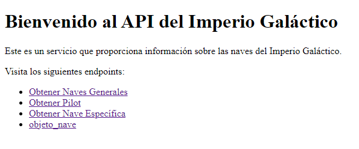

# 🚀 **Proyecto de Nave de Imperio Galáctico - API de Pilotos** 🌌

Bienvenido al proyecto **Imperio Galáctico**, donde exploramos la **Imperio Galáctico** para obtener información sobre los pilotos de naves galácticas. Este proyecto utiliza **Flask** y **Python** para consumir y mostrar datos detallados de los pilotos de la saga.

## 📦 **Requisitos**

Asegúrate de tener instalados los siguientes requisitos:

- **Python 3.12+**
- **Flask**

Si no tienes las dependencias instaladas, puedes hacerlo ejecutando:
## Bash
- ** pip install -r requirements.txt**

Para ejecutar el proyecto deberas estar en la carpeta Prueba \Senado_Galactico\\Proyecto\ y ejecutar el comando  python run.py

Luego una vez ejecutado el proceso veras en la consola la ip para poder acceder al html donde podras ejecutar cada uno de los llamados.  

aplicacion arriba !

🧑‍💻 Desarrollo y Contribución
Si quieres contribuir a este proyecto, ¡serás muy bienvenido! Aquí están los pasos para comenzar:

Haz un fork de este repositorio.
Clona tu fork en tu máquina local.
Crea una nueva rama para trabajar en tus cambios.
Realiza tus cambios, asegúrate de que todo funcione correctamente.
Realiza un pull request para revisar tus cambios.

📄 Licencia
Este proyecto está bajo la Licencia MIT. ¡Siéntete libre de usarlo, modificarlo y compartirlo!
By dchinchilla23